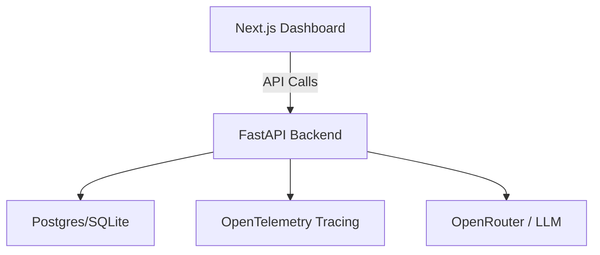

# Agent Control Room

**Agent Control Room** is "Chrome DevTools for AI Agents." It provides a high-fidelity observability platform to track, debug, and optimize AI agent executions in real-time.

Whenever an AI agent runs, you can capture:
* **Inputs & Outputs**: See exactly what was received and sent.
* **Trace Timeline**: A step-by-step breakdown of LLM calls and tool usage.
* **Cost Tracking**: Precise token usage and dollar cost calculation.
* **Performance**: Latency monitoring for every single step.

---

##  Real-World Problem Solved

AI agents often fail silently, hallucinate, or run up unexpected costs. Agent Control Room provides the visibility needed to build reliable AI systems:
-  **Observability**: No more "black box" executions.
-  **Debugging**: Replay and inspect failed steps.
-  **Cost Tracking**: Know exactly where your budget is going.
-  **Reliability**: Identify performance bottlenecks instantly.

---

##  System Architecture

---

##  Core Features

###  Execution Tracking
- Capture input prompts and final agent responses.
- Track status (Success/Failure/Running).

###  Step-by-Step Trace
- Visualize the exact flow: `User Query → LLM → Tool Call → API Response → Final Answer`.
- Detailed inspection of JSON inputs and outputs for every step.

###  Cost & Latency
- Automatic token counting and cost calculation.
- Millisecond-accurate latency tracking per step.

###  Premium Dashboard
- Sleek dark-mode interface.
- Markdown rendering for agent responses.
- Interactive trace timeline.

---

##  Tech Stack

- **Backend**: FastAPI, SQLAlchemy, OpenTelemetry.
- **Frontend**: Next.js 15, Tailwind CSS, React Markdown.
- **Database**: PostgreSQL (Production) / SQLite (Development).
- **Inference**: OpenRouter (NVIDIA Nemotron).

---

##  Getting Started

### Backend Setup
1. `cd backend`
2. `pip install -r requirements.txt`
3. `python main.py`

### Frontend Setup
1. `cd frontend`
2. `npm install`
3. `npm run dev`

---

