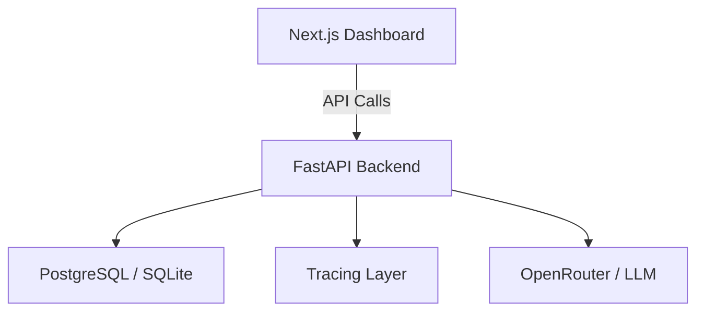

#  Agent Control Room Chrome DevTools for AI Agents

**Agent Control Room** is a full-stack **AI observability platform** inspired by Chrome DevTools. It enables teams to **trace, debug, monitor, and optimize AI agent executions in real time**.

It provides deep visibility into every AI run, including:

* **Inputs & Outputs** → inspect exact prompt-response flow
* **Trace Timeline** → step-by-step LLM and tool execution breakdown
* **Cost Tracking** → token usage + dollar cost analytics
* **Latency Monitoring** → millisecond-level performance insights
* **Failure Replay** → inspect failed executions for debugging

---

#  Real-World Problem Solved

Modern AI agents often behave like **black boxes**.
They may:

* hallucinate
* silently fail
* exceed token budgets
* introduce latency bottlenecks
* break tool chains in production

**Agent Control Room solves this by making every run observable and replayable.**

 **Observability** – complete run visibility
 **Debugging** – inspect failures step-by-step
 **Cost Optimization** – track token spend precisely
 **Reliability** – detect latency and failure hotspots

---

#  System Architecture



---

#  Core Features

##  Execution Tracking

* Capture input prompts and final LLM responses
* Track execution status: **Success / Failure / Running**
* Store run metadata and model information

##  Step-by-Step Trace Explorer

* Visualize complete flow:
  `User Query → LLM → Tool → API → Final Answer`
* JSON inspection for every input and output
* Run explorer for deep debugging

##  Cost & Latency Analytics

* Automatic token usage tracking
* Dollar-level inference cost visibility
* Millisecond latency per step
* Prompt optimization experiments

##  Premium Dashboard UI

* Sleek dark mode dashboard
* Markdown response rendering
* Interactive trace explorer
* Clean developer-first debugging UX

---

#  Tech Stack

* **Backend:** FastAPI, SQLAlchemy
* **Frontend:** Next.js, Tailwind CSS, React Markdown
* **Database:** PostgreSQL / SQLite
* **LLM Provider:** OpenRouter (NVIDIA Nemotron)
* **Observability:** Structured tracing + latency analytics

---

#  Getting Started

## Backend Setup

```bash
cd backend
pip install -r requirements.txt
python main.py
```

Backend runs on:

```bash
http://localhost:8000
```

Swagger docs:

```bash
http://localhost:8000/docs
```

---

## Frontend Setup

```bash
cd frontend
npm install
npm run dev
```

Frontend runs on:

```bash
http://localhost:3000
```

---

#  Example Test Prompts

Use these prompts to generate observability traces:

```text
Compare LangChain vs LlamaIndex for enterprise RAG.
```

```text
How can we reduce LLM token cost in production?
```

```text
Why do RAG systems hallucinate even with correct retrieval?
```

---

#  Project Impact & Engineering Outcomes

This project demonstrates the ability to build **production-style AI infrastructure systems**, not just prototype demos.

##  Engineering Outcomes

* Built an end-to-end **AI observability workflow** from prompt input to trace visualization
* Measured and optimized **latency, token usage, and response quality** using real prompts
* Debugged **timeout and failure scenarios** through trace replay and run analytics
* Improved prompt efficiency by comparing **long vs concise prompt variants**
* Validated the system on **enterprise RAG, agent workflow, and reasoning prompts**
* Designed a reusable dashboard pattern for **future multi-agent and tool-call tracing**

##  Real-World Use Cases

This architecture can directly support:

* **Enterprise RAG monitoring**
* **LLM cost governance dashboards**
* **AI support agent debugging**
* **Latency bottleneck analysis**
* **Prompt experimentation workflows**
* **Hallucination and failure investigation**

This makes the project highly relevant for **GenAI platforms, LLMOps tooling, and AI infrastructure teams**.

---

#  Future Enhancements

* Multi-agent workflow tracing
* Tool-call observability
* RAG citation tracing
* Hallucination detection
* Retry + fallback model pipelines
* Streaming response analytics
* Prompt versioning

---

# Skills Demonstrated & Why They Matter

This project showcases strong **production-grade GenAI + full-stack engineering skills**.

##  Core Skills Used

* **Python** → backend APIs, request handling, LLM orchestration
* **FastAPI** → high-performance REST APIs for execution tracing
* **SQLAlchemy** → structured run metadata and persistence layer
* **Next.js** → modern frontend dashboard for observability
* **Tailwind CSS** → premium dark-mode UI and developer dashboard styling
* **React Markdown** → rendered structured LLM outputs and tables
* **OpenRouter / NVIDIA Nemotron** → enterprise LLM inference integration
* **Prompt Engineering** → tested concise vs complex prompts for latency + token optimization
* **LLMOps / Observability** → tracing, failure replay, latency analytics, token cost monitoring
* **Debugging & Performance Optimization** → identified timeout bottlenecks and optimized prompts
* **Git & GitHub** → version control, public portfolio repository, documentation workflows
* **System Design** → dashboard ↔ backend ↔ database ↔ LLM architecture thinking

##  Why These Skills Are Important

These skills directly map to real **GenAI Engineer / AI Platform / LLMOps roles** because modern AI systems need:

* reliable prompt pipelines
* observability dashboards
* cost control
* latency monitoring
* failure debugging
* scalable APIs
* production-ready frontend visualization

This project proves hands-on ability to **build, run, debug, optimize, and document enterprise AI workflows end-to-end.**

---

#  Author

Built by **Atharva Chavhan** 
